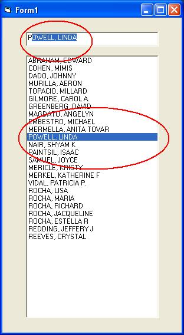

<div align="center">

## Autocomplete Textbox plus listbox


</div>

### Description

Autocomplete textbox and listbox in one. Gets data from a recordset then populate the listbox. Autofills the textbox then synchronously highlights the listbox. Great autocomplete please vote for ME.
 
### More Info
 
NOTE: Applicable to 32k of entries in the database. Anything larger than that, it will crash because listbox can't hold more than 32k of data. Cheers!!!


<span>             |<span>
---                |---
**Submitted On**   |2006-12-09 04:21:16
**By**             |[Juanito Dado Jr](https://github.com/Planet-Source-Code/PSCIndex/blob/master/ByAuthor/juanito-dado-jr.md)
**Level**          |Beginner
**User Rating**    |4.8 (19 globes from 4 users)
**Compatibility**  |VB 6\.0
**Category**       |[Databases/ Data Access/ DAO/ ADO](https://github.com/Planet-Source-Code/PSCIndex/blob/master/ByCategory/databases-data-access-dao-ado__1-6.md)
**World**          |[Visual Basic](https://github.com/Planet-Source-Code/PSCIndex/blob/master/ByWorld/visual-basic.md)
**Archive File**   |[Autocomple2036511292006\.zip](https://github.com/Planet-Source-Code/juanito-dado-jr-autocomplete-textbox-plus-listbox__1-67330/archive/master.zip)

### API Declarations

```
Option Explicit
'API call to listbox
Private Declare Function SendMessage Lib "user32" Alias "SendMessageA" ( _
 ByVal hwnd As Long, _
 ByVal wMsg As Long, _
 ByVal wParam As Long, _
 ByRef lParam As Any _
) As Long
Const LB_FINDSTRING = &amp;H18F
```


